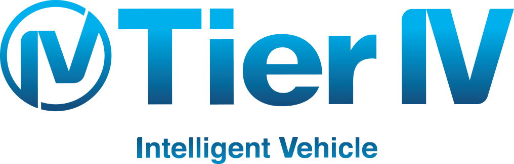

## We’re Building an Open Source Self-Driving Car
#### And we want your help!

At [Udacity](https://udacity.com), we believe in democratizing education. How can we provide opportunity to everyone on the planet? We also believe in teaching really amazing and useful subject matter. When we decided to build the [Self-Driving Car Nanodegree program](https://udacity.com/nd013), to teach the world to build autonomous vehicles, we instantly knew we had to tackle our own self-driving car too.

Together with [Google](https://google.com) Self-Driving Car founder and [Udacity](https://udacity.com) President Sebastian Thrun, we formed our core Self-Driving Car Team. One of the first decisions we made? **Open source code, written by hundreds of students from across the globe!**

**[You can read more about our plans for this project](https://medium.com/udacity/were-building-an-open-source-self-driving-car-ac3e973cd163#.bm5c5chek).**

## Contributions
Here's a list of the projects we've open sourced:

* [**Deep Learning Steering Models**](https://github.com/udacity/self-driving-car/tree/master/steering-models) – Many different neural networks trained to predict steering angles of the car. More information [here](https://medium.com/p/d73217f2492c).
* [**Camera Mount**](https://github.com/udacity/camera-mount) by [@spartanhaden](https://twitter.com/spartanhaden) – A mount to support a lens and camera body that can be mounted using standard GoPro hardware
* [**Annotated Driving Datasets**](https://github.com/udacity/self-driving-car/tree/master/annotations) – Many hours of labelled driving data
* [**Driving Datasets**](https://github.com/udacity/self-driving-car/tree/master/datasets) – Over 10 hours of driving data (LIDAR, camera frames and more)
* [**ROS Steering Node**](https://github.com/udacity/self-driving-car/tree/master/steering-models/steering-node) – Useful to enable the deep learning models to interact with ROS

## How to Contribute
First, some important places to join:

* Join the [announcements-only mailing list](https://groups.google.com/a/udacity.com/forum/#!forum/self-driving-car-announcements)
* Join the [Slack team](http://nd013.udacity.com)
* Fill out the [individual contributor agreement](https://goo.gl/forms/iIdeCge8UHpkG96C3) to be whitelisted

Like any open source project, this code base will require a certain amount of thoughtfulness. However, when you add a 2-ton vehicle into the equation, we also need to make safety our absolute top priority, and pull requests just don’t cut it. To really optimize for safety, we’re breaking down the problem of making the car autonomous into **[Udacity Challenges](http://udacity.com/self-driving-car)**.

#### Challenges
Each challenge will contain awesome prizes (cash and others) for the most effective contributions, but more importantly, the challenge format enables us to benchmark the safety of the code before we ever think of running it in the car. We believe challenges to be the best medium for us to build a Level-4 autonomous vehicle, while at the same time offering our contributors a valuable and exciting learning experience.

**You can find a current list of challenges, with lots of information, on the [Udacity self-driving car page](http://udacity.com/self-driving-car). This is the primary way to contribute to this open source self-driving car project.**

## Core Contributors
[@ericrgon](https://twitter.com/ericrgon) 
[@macjshiggins](https://twitter.com/macjshiggins) 
[@olivercameron](https://twitter.com/olivercameron) 

## Open Source Base Software Support
 

