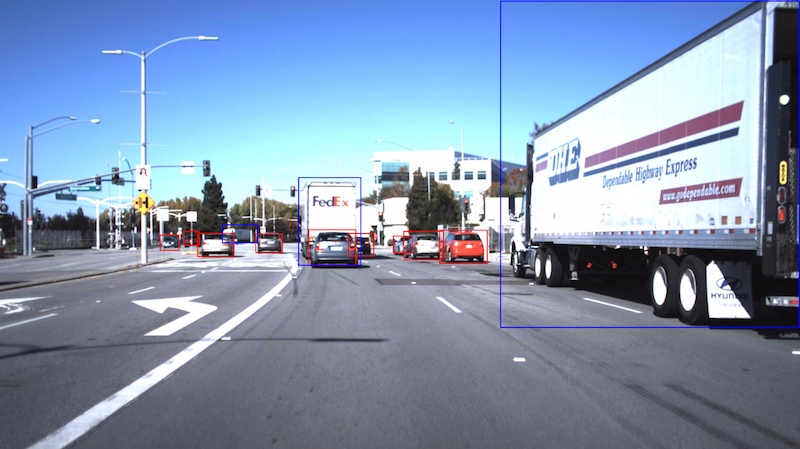
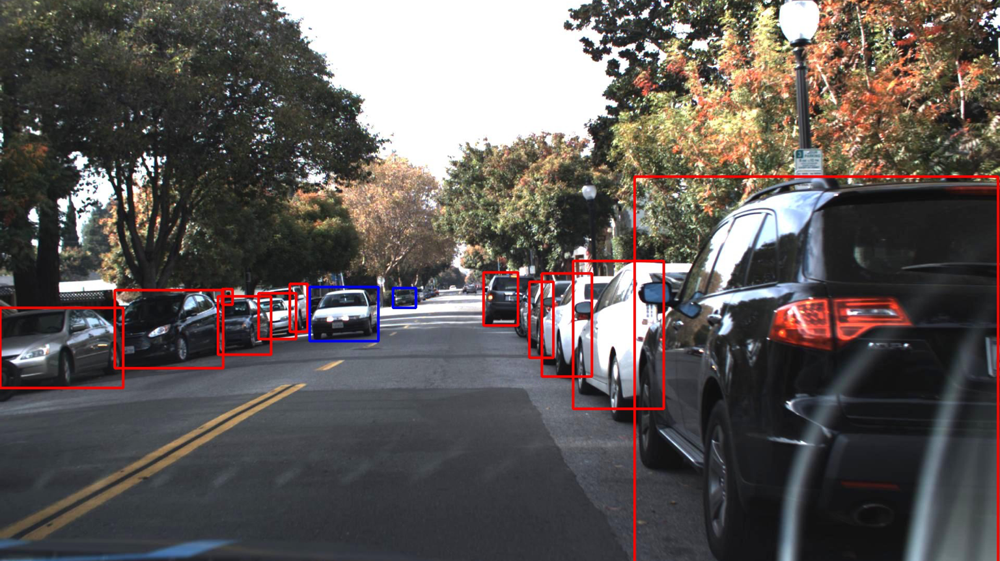

# Annotated Driving Dataset

## Dataset 1 

The dataset includes driving in Mountain View California and neighboring cities during daylight conditions. It contains over 65,000 labels across 9,423 frames collected from a Point Grey research cameras running at full resolution of 1920x1200 at 2hz. The dataset was annotated by [CrowdAI](http://crowdai.com) using a combination of machine learning and humans. 

#### Labels 

- Car 
- Truck 
- Pedestrian 

#### CSV Format

- xmin
- ymin
- xmax
- ymax
- frame
- label
- preview url for frame

<table>
<tr>
    <td>Size</td>
    <td>1.5 GB</td>
</tr>
<tr>
    <td>Annotator</td>
    <td><a href="http://crowdai.com">CrowdAI</td>
</tr>
</table>

### [Download](http://bit.ly/udacity-annoations-crowdai)

## Dataset 2 

This dataset is similar to dataset 1 but contains additional fields for occlusion and an additional label for traffic lights. The dataset was annotated entirely by humans using [Autti](http://autti.co) and is slightly larger with 15,000 frames. 

#### Labels 

- Car 
- Truck 
- Pedestrian
- Street Lights 

#### CSV Format
- frame 
- xmin
- ymin
- xmax
- ymax
- occluded
- label
- attributes (Only appears on traffic lights)

<table>
<tr>
    <td>Size</td>
    <td>3.3 GB</td>
</tr>
<tr>
    <td>Annotator</td>
    <td><a href="http://autti.co/">Autti</td>
</tr>
</table>

### [Download](http://bit.ly/udacity-annotations-autti)
