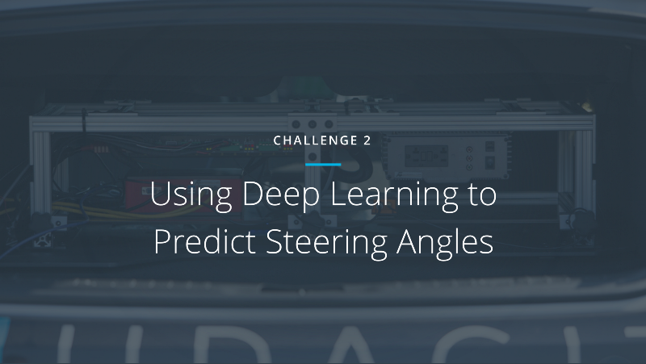

## Challenge 2
For detailed information on submissions for Challenge 2, please check out [this medium post](https://medium.com/@maccallister.h/challenge-2-submission-guidelines-284ce6641c41#.az85snjmh) by [@macjshiggins](https://twitter.com/macjshiggins)

## Neural Network Evaluation Code
Massive thanks to Machine Learning wizard [Mikel Bober-Irizar (@anokas on the Udacity CarND Slack Channel)](https://github.com/mxbi)! Without him, we wouldn't have any method for evaluating how well submitted code is actually performing. He is a stellar example of the incredible community that has been built around the world's first open source self-driving car at Udacity.

## Final Leaderboard

Additionally, you may have noticed that Team Autumn, who had the first place submission at the end of the competition period, is not present on the final leaderboard. This is due to complications resulting in the inability to replicate their results, precluding them from the prizes in the competition. We have included [Jesse Hu's writeup here](https://github.com/udacity/self-driving-car/tree/master/steering-models/community-models/autumn) on his innovative approach to the problem using optical flow computation, along with [another model he submitted](https://github.com/udacity/self-driving-car/tree/master/steering-models/evaluation) in the evaluation section of the repository.

For reference, an example file filled with '0' for every steering prediction scores 0.20678229236453141.

| Rank | Team Name |   Public Score  |  Private Score  |
| ---- | :--------:| ---------------:| ---------------:|
| 1  | komanda     | 0.0482910511682 | 0.0512445872957 |
| 2  | rambo       | 0.0578777529417 | 0.0559772239809 |
| 3  | chauffeur   | 0.0581632959656 | 0.0572092577972 |
| 4  | lookma      | 0.0744836851286 | 0.0715816793796 |
| 5  | rwightman   | 0.0773626626306 | 0.0742618315107 |
| 6  | epoch       | 0.0791988018266 | 0.0789042611404 |
| 7  | bitas       | 0.0954944520962 | 0.0944256921923 |
| 8  | ai-world    | 0.1028687370140 | 0.0988366890120 |
| 9  | bauer       | 0.1061797124430 | 0.1057412403060 |
| 10 | fsc3        | 0.1216643438960 | 0.1201914476140 |

## Round 1 Leaderboard

For reference, an example file filled with '0' for every steering prediction scores 0.035665505598782017.

| Rank | Team Name        |     Public Score     |    Private Score     |
| ---- | :---------------:| --------------------:| --------------------:|
| 1    | komanda          | 0.019354826554271058 | 0.019000886503484679 |
| 2    | rambo            | 0.024043031353416212 | 0.023139445736868425 |
| 3    | chauffeur        | 0.024799567374978741 | 0.024630170556960426 |
| 4    | rwightman        | 0.025382078860711952 | 0.024652455035466161 |
| 5    | epoch            | 0.029204824313005848 | 0.028311347483058014 |
| 6    | lookma           | 0.029812086032704476 | 0.028358303595130471 |
| 7    | andre            | 0.02993788506224929  | 0.028726047921710424 |
| 8    | ai-world         | 0.030237998400137252 | 0.028816583237209977 |
| 9    | autumn           | 0.030146843269163438 | 0.029024739076791626 |
| 10   | three-musketeers | 0.031684487565107521 | 0.029599617257261870 |
| 11   | fsc              | 0.031239015007820548 | 0.030011184271148059 |
| 12   | jeffd23          | 0.031372997721939133 | 0.030040979056168659 |
| 13   | lab              | 0.032098858758217365 | 0.031068155110669536 |
| 14   | team-sf          | 0.034779221439476628 | 0.033373129399809916 |
| 15   | bitas            | 0.035121636548452885 | 0.033737833847975851 |

 

