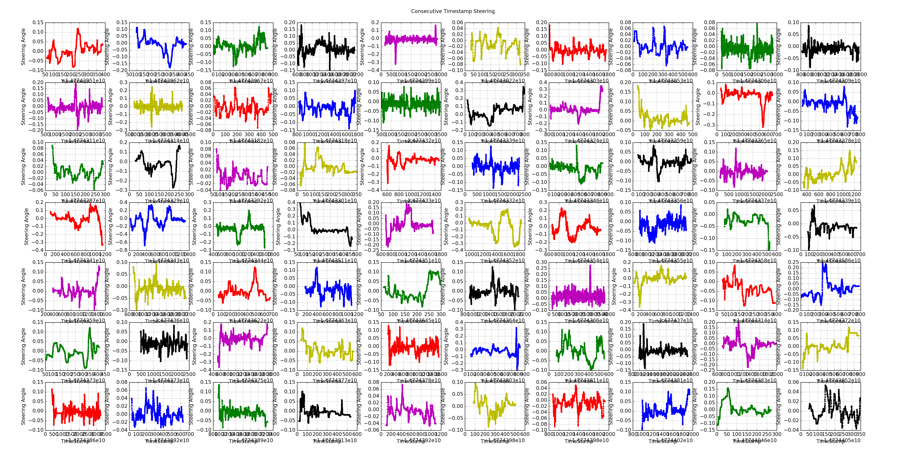
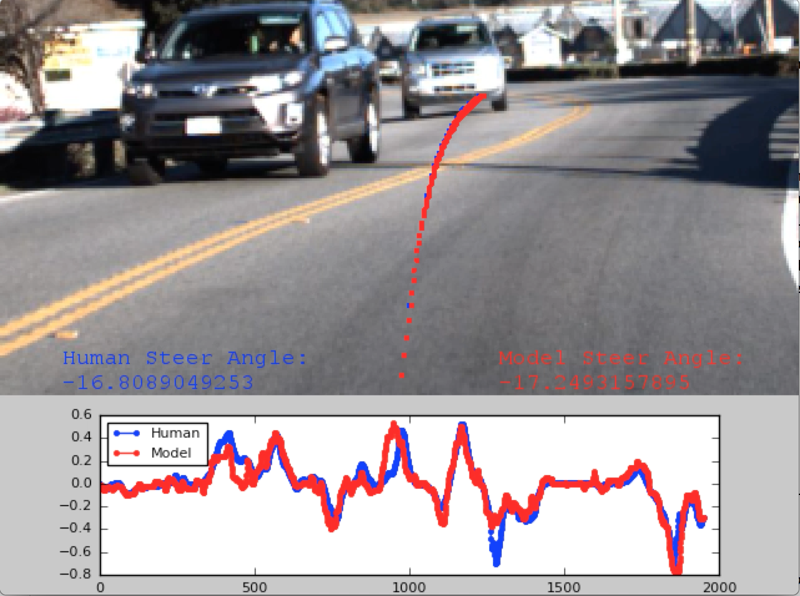
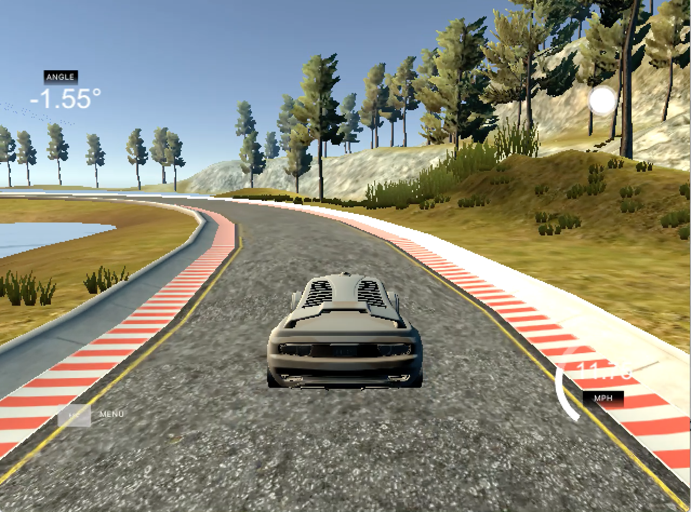

# UdacitySDC-Challenge2
Code and writeup for Udacity Challenge 2 - Using Deep Learning to Predict Steering Angles

# Intro
What a challenge! There were great teams from all over the world who collaborated and competed to produce some impressive results. After talking with a number of students who were interested in Challenge #2 at the Udacity “Outside the Lines” event, I was motivated to put together a writeup describing the process that I used and the code I developed. I created Team Epoch, which finished 5th place in the Round 1 and 7th place in Round 2. My goal in posting this is to make it easier for more people to get involved.

If you haven’t already, I would start by reading the Challenge #2 description here: 
https://medium.com/@maccallister.h/challenge-2-submission-guidelines-284ce6641c41#.p7d52u3o6

# Running the Code in this Repository
Training a Model: Once you have the training/validation data in the /dataset directory with the structure:
```
camera.csv  center/  left/  right/  steering.csv
```
You will need epoch_data.py, epoch_model.py and epoch_test.py. Run the following command on CPU or GPU to start training a model:
```
python epoch_test.py --dataset dataset/ --model cnn --nb-epoch 50 --resized-image-height 128 --resized-image-width 128
```
Testing a Model for Round 2: Once you have the test data in the /testset directory with the structure:
```
camera.csv  center/  final_example.csv
```
You will need epoch_data_hmb.py, epoch_model.py and epoch_test_hmb.py. Run the following command on CPU or GPU to test a model:
```
python epoch_test_HMB.py --dataset testset/ --model cnn --nb-epoch 1 --resized-image-height 128 --resized-image-width 128
```
# Acknowledgements 
First off I need to acknowledge dolaameng, rwightman and comma.ai. 
- I used dolaameng’s code (https://github.com/dolaameng/udacity-SDC-baseline) as a starting point, which saved a lot of time initially.
- rwightman’s reader (https://github.com/rwightman/udacity-driving-reader) for extracting the ROS .bag files was invaluable for this competition.
- I modified comma.ai’s viewer (https://github.com/commaai/research) to create videos of the final test set.

# Hardware
It sounded like a few of the teams had personal GPU setups, but my setup was pretty basic.
- Macbook Pro (2015) 8GB RAM, 2.7 GHz Intel Core i5, 1TB external storage
- VirtualBox Ubuntu 16.04 64 bit - Desktop Disk Image here: http://releases.ubuntu.com/16.04/
- AWS g2.2xlarge with AMI from Stanford CS231n: http://cs231n.github.io/aws-tutorial/

## Steps To Setup AWS
1. Open an instance with Stanford's AMI and at least 40GB EBS Volume
2. Upload your dataset as a .tar using sftp
3. Install Tensorflow: pip install https://storage.googleapis.com/tensorflow/linux/gpu/tensorflow-0.9.0rc0-cp27-none-linux_x86_64.whl
  - I used Tensorflow r0.9 because I knew it worked with Stanford's AMI with minimal changes
4. Stanford's AMI has CUDA 7.5 and CuDNN v3 installed, but you need CuDNN v4 or higher for tensorflow with GPU
  - Read about installing CuDNN v4 here: https://medium.com/@acrosson/installing-nvidia-cuda-cudnn-tensorflow-and-keras-69bbf33dce8a#.e0mlt5ic3
5. Update Keras version and change backend to Tensorflow: 
  - git clone https://github.com/fchollet/keras.git
  - cd keras
  - python setup.py install
  - https://keras.io/backend/

# Objective
The basic goal was to use data collected from Udacity’s Self Driving Car to build a model that would predict the steering angles for the vehicle. This problem was well suited for Convolutional Neural Networks (CNNs) that take in the forward facing images from the vehicle and output a steering angle. This Challenge can be treated as a classification or regression problem. After some initial trials with classification (binning the steering angles into classes), regression proved more successful and easier to implement for me. A model's success was measured using the root mean square (RMS) error of the predicted steering versus the actual human steering. 

# Data
The data collected from the Udacity car was images (mostly .jpg) from 3 cameras (left, center, right spaced 20 inches apart) and steering angles. There are several different data sets, but in the end I only ended up using the final two as some of the camera issues had been worked out by that point. The first one (I will refer to as Dataset 1) is a little over an hour of driving from El Camino Real and the second (Dataset 2) is a combination of highway driving and curvy driving over Highway 92 from San Mateo to Half Moon Bay. The links to the torrents for the datasets are here: 

- Dataset 1: https://github.com/udacity/self-driving-car/tree/master/datasets
- Dataset 2: https://github.com/udacity/self-driving-car/tree/master/datasets/CH2  (I would start with this one)

After installing Docker on my virtual box and creating a shared directory from the virtual box to my local machine where I stored the .bag files, I ran the rwightman’s run-bagdump.sh script which generated directories with the format: 
```
camera.csv  center/  left/  right/  steering.csv
```
Just for clarity, here are all the steps that I took to get the data:
  1.	Download VirtualBox
  2.	Install Ubuntu 16.04 on VirtualBox
  3.	Install Docker with this link: https://docs.docker.com/engine/installation/linux/ubuntulinux/
  4.	Download rwightman’s repository to VirtualBox
  5.	Download transmission for torrents: http://transmissionbt.com
  6.	Download the torrents to your local machine
  7.	Setup shared directories between your VirtualBox and local machine/external storage
  8.	Run rwightman’s reader

If you make it through that process, then you are at least half way there!

## Exploration
Each image and steering angle is associated with a certain timestamp. I copied dolaameng’s approach, which was to average the steering angles within each timestamp. The datasets were also somewhat cleaned by Udacity (stoplights and lane changes removed) so the timestamps were not continuous. I wrote a script (data_explore.py) that plotted all of the steering angles for each consecutive series of timestamps, so that I could further clean/select my training data.


# Data Processing and Augmentation
This is where most of the gains in my performance were made. I used different approaches for Round 1 and Round 2, which are described below. Note that for Round 1, the Half Moon Bay dataset (lots of curves) had not yet been released.

## Round 1 
For the first Round I used only the center camera data from Dataset 1 to train my model. The key technique that I implemented during this Round was k-fold cross validation. After running through all the k-folds, I chose a single training set and validation set that gave me a close match the RMS error that I was seeing on the leaderboard. I re-trained the model with just this training and validation data. This allowed me to make informed changes to my model. You can see the plot of my validation performance below (Validation RMS = 0.028 versus Leaderboard Test RMS=0.029). 


I also applied these techniques:
  1.	Cropped the center camera images to be 280 X 640 (removed most of the image above the horizon line).
  2.	Resized the images to 128 X 128 (Will discuss more in the model section)

## Round 2
For Round 2 the Dataset 2 had also been released. This gave us data that had significantly more turns. One important requirement of Round 2 was that the model would still beat the benchmark for the Round 1 test set. Taking this in mind, I did a lot of trials using different amounts of data from each Dataset (1 and 2) to see how the performance would vary on each test set. There was a lot of straight driving data and not a lot of data with turns, so I ended up removing several of the straight driving sections of data from Dataset 1. 

I also applied the following approaches:
  1.	Cropped the camera images to be 280 X 640 (removed most of the image above the horizon line).
  2.	Resized the images to 128 X 128 (Will discuss more in the model section)
  3.	Horizontal image flipping (Sign of steering angle also needs to be flipped)
  4.	Left/Right camera shifts (Use images from the left/right camera, but adjust the steering angle to move back to center within 2 seconds)
  5.	Small rotations with no modification to steering angle (To simulate jittering of camera)

Each of these techniques helped with overfitting and gave incremental improvements to my results.

# Model
This isn’t the most exciting architecture, but after trying a lot of different CNN models including transfer learning and NVIDIA’s model (https://devblogs.nvidia.com/parallelforall/deep-learning-self-driving-cars/), the best results that I was able to produce for this challenge was with the following simple structure. The input image size was 128 X 128 X 3. It is similar to a VGG style with 3 X 3 conv layers followed by 2 X 2 max pooling with stride 2 and increasingly aggressive dropout towards the top layers. I’ve used similar models for other applications in the past as my ‘baseline’, but with a little tuning this one ended up performing best. 
```
x = Convolution2D(32, 3, 3, activation='relu', border_mode='same')(img_input)
x = MaxPooling2D((2, 2), strides=(2, 2))(x)
x = Dropout(0.25)(x)

x = Convolution2D(64, 3, 3, activation='relu', border_mode='same')(x)
x = MaxPooling2D((2, 2), strides=(2, 2))(x)
x = Dropout(0.25)(x)

x = Convolution2D(128, 3, 3, activation='relu', border_mode='same')(x)
x = MaxPooling2D((2, 2), strides=(2, 2))(x)
x = Dropout(0.5)(x)

y = Flatten()(x)
y = Dense(1024, activation='relu')(y)
y = Dropout(.5)(y)
y = Dense(1)(y)

model = Model(input=img_input, output=y)
model.compile(optimizer=Adam(lr=1e-4), loss = 'mse')
```
## Structure and Parameters
| Layer | Size | Memory (Forward Pass) | # Parameters (Not Counting Bias) |
| ---- | :------------------:| --------:| ---------------:|
| input | 128 X 128 X 3 | 0.05 MB | 0 |
| conv1 | 128 X 128 X 32 | 0.52 MB | 864 | 
| pool1 | 64 X 64 X 32 | 0.13 MB | 0 | 
| conv2 | 64 X 64 X 64 | 0.26 MB | 18432 | 
| pool2 | 32 X 32 X 64 | 0.07 MB | 0 | 
| conv3 | 32 X 32 X 128 | 0.80 MB | 73728 | 
| pool3 | 16 X 16 X 128 | 0.20 MB | 0 | 
| FC1 | 1 X 1 X 1024 | 0.001 MB | 33554432 | 

Based on the notes from Stanford's CS231n, this gives 8 MB (~2MB * 4 bytes) for each image on forward pass and 16 MB on the backward pass.  Using a batch size of 32, the max memory usage will be 512 MB during the backward pass.

Over 99% of the parameters in this model are in the FC1 layer. Comparing the structure and parameters to NVIDIA’s model, at nearly 34 million parameters, this model has significantly more parameters than NVIDIA’s. Even with the dropout and various image augmentation techniques this model still overfits. I implemented early-stopping and ‘save best only’ in keras to combat this:
```
callbacks = [EarlyStopping(monitor='val_loss', patience=3, verbose=0), 
                         ModelCheckpoint(filepath=os.path.join('weights_HMB_' + str(num_fold) + '.hdf5'), 
                         monitor='val_loss', verbose=0, save_best_only=True)]
```
In the end I was able to train the model for 25-30 Epochs before it would start over-fitting.

# Data Generator
Using a data generator is essential and I used a modified version of dolaameng’s for the training, validation and testing. This allowed me to adjust the steering angles as necessary for shifts and flips. It is important to note that the training data should always be shuffled, whereas the validation and testing data are not. I experimented with batch size, but was able to get good performance with batches as small as 32.

# Post-Processing Steering Angles from Model
I found that applying different types of smoothing to the steering angles output from model improved the RMS error. In the end I used exponential smoothing (Brown’s Method) with a smoothing factor (alpha=0.4). This method only looks at past steering angles rather than future steering angles. I didn’t think that using future steering angles was realistic for actual driving as you create a lag in the steering that is relative to how far in the future you look. Even the exponential smoothing creates a small time lag to the steering. Looking at the steering angles with and without smoothing, I estimated the time lag due to smoothing to be 1 timestamp or 1/20 of a second. While the lag is an undesired outcome, the positive outcome is a much smoother driving experience.  

# Results
You can see the final RMS results on the public/private leaderboard here:
https://github.com/udacity/self-driving-car/tree/master/challenges/challenge_2

This video shows the results of the model for the test section on Highway 92 and was based on comma.ai's research:
https://www.youtube.com/watch?v=huwkqWXVax8&t=131s       (The script is epoch_viewer.py)



Here is the model in the simulator for the behavioral cloning project, without training the model on any simulator data, only real word data, here is the result:
https://www.youtube.com/watch?v=EcS5JPSH-sI



*Note that I did have to change the sign on the steering angles and scale them due to the wider road/lanes in the simulator. Would be interesting to see if a model only trained in the simulator or on a combination of simulator/real world data could outperform the current model.

# Conclusions
This was really fun and it sounds like Udacity is trying to go as far as they can with using image based techniques for their open source vehicle and will have similar competitions in the future. Hopefully this repository can serve as a launching point for other students to implement other approaches to improve the performance of this model. I'm personally looking forward to learning more skills in the Udacity course that I can implement.
