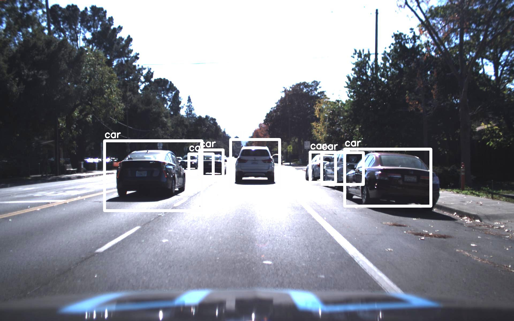

This package is originally implmented by @[thtrieu](https://github.com/thtrieu). The original yolo models are trained against the annotated Udacity SDC datasets, and is now capable of detecting cars, pedestrians and traffic lights. The performance is not perfect, but it does run at real-time on a GTX1070. Looking forward to more improvements from the Udacity community.

## Dependencies

Python3, tensorflow 0.12, numpy, opencv 3.

## Update

@[Ryansun](https://github.com/ryansun1900) contributed the **training part of YOLO9000**. The project is now completed :)

Someone's quick and 
**Android demo is available on Tensorflow's official github!** [here](https://github.com/tensorflow/tensorflow/blob/master/tensorflow/examples/android/src/org/tensorflow/demo/TensorFlowYoloDetector.java)

**Demo in webcam is available!**. Use option `--demo camera` :)

YOLOv1 is up and running:
- v1.0: `yolo-full` 1.1GB, `yolo-small` 376MB, `yolo-tiny` 180MB
- v1.1: `yolov1` 789MB, `tiny-yolo` 108MB, `tiny-coco` 268MB, `yolo-coco` 937MB

YOLO9000 is up and running:
- `yolo` 270MB, `tiny-yolo-voc` 63 MB.

### Parsing the annotations

Skip this if you are not training or fine-tuning anything (you simply want to forward flow a trained net)

For example, if you want to work with only 3 classes `tvmonitor`, `person`, `pottedplant`; edit `labels.txt` as follows

```
tvmonitor
person
pottedplant
```

And that's it. `darkflow` will take care of the rest.

### Design the net

Skip this if you are working with one of the three original configurations since they are already there. Otherwise, see the following example:

```python
...

[convolutional]
batch_normalize = 1
size = 3
stride = 1
pad = 1
activation = leaky

[maxpool]

[connected]
output = 4096
activation = linear

...
```

### Flowing the graph using `flow`

```bash
# Have a look at its options
./flow --h
```

First, let's take a closer look at one of a very useful option `--load`

```bash
# 1. Load yolo-tiny.weights
./flow --model cfg/yolo-tiny.cfg --load bin/yolo-tiny.weights

# 2. To completely initialize a model, leave the --load option
./flow --model cfg/yolo-3c.cfg

# 3. It is useful to reuse the first identical layers of tiny for 3c
./flow --model cfg/yolo-3c.cfg --load bin/yolo-tiny.weights
# this will print out which layers are reused, which are initialized
```

All input images from default folder `test/` are flowed through the net and predictions are put in `test/out/`. We can always specify more parameters for such forward passes, such as detection threshold, batch size, test folder, etc.

```bash
# Forward all images in test/ using tiny yolo and 100% GPU usage
./flow --test test/ --model cfg/yolo-tiny.cfg --load bin/yolo-tiny.weights --gpu 1.0
```

### Training new model

Training is simple as you only have to add option `--train` like below:

```bash
# Initialize yolo-3c from yolo-tiny, then train the net on 100% GPU:
./flow --model cfg/yolo-3c.cfg --load bin/yolo-tiny.weights --train --gpu 1.0

# Completely initialize yolo-3c and train it with ADAM optimizer
./flow --model cfg/yolo-3c.cfg --train --trainer adam
```

During training, the script will occasionally save intermediate results into Tensorflow checkpoints, stored in `ckpt/`. To resume to any checkpoint before performing training/testing, use `--load [checkpoint_num]` option, if `checkpoint_num < 0`, `darkflow` will load the most recent save by parsing `ckpt/checkpoint`.

```bash
# Resume the most recent checkpoint for training
./flow --train --model cfg/yolo-3c.cfg --load -1

# Test with checkpoint at step 1500
./flow --model cfg/yolo-3c.cfg --load 1500

# Fine tuning yolo-tiny from the original one
./flow --train --model cfg/yolo-tiny.cfg --load bin/yolo-tiny.weights
```

### Training against Udacity Self Driving Datasets

Udacity Self Driving Car course have provided an annotated dataset of images that contains bounding boxes for five classes of objects: cars, pedestrians, truck, cyclists and traffic lights.

A model cfg based on v1.1/tiny-yolo is provided for the udacity dataset in cfg/v1.1/tiny-yolov1-5c.cfg, with a TensorFlow checkpoint [here](https://drive.google.com/file/d/0B2K7eATT8qRARVVvcGtQUzRBV1E/view?usp=sharing). A v2 tiny-yolo configuration for the udacity dataset could be found under cfg/tiny-yolo-udacity.cfg, with checkpoint [here](https://drive.google.com/file/d/0B2K7eATT8qRAY0g0aWhjdkw0bEU/view?usp=sharing)

To train tiny-yolov1.weights from for the udacity dataset, the following step was taken: 1. Download udacity dataset [here](http://bit.ly/udacity-annotations-autti) and download the following [annotation file](https://drive.google.com/file/d/0B2K7eATT8qRAZHlsdTVCNWVLVnM/view?usp=sharing).

Create a small dataset with 3-5 images, and train via:
```
python3 flow --train --model cfg/v1.1/tiny-yolov1-5c.cfg --load tiny-yolov1.weights --dataset <folder to udacity images> --gpu 1.0
```

Reduce the learning rate in the cfg file, and continue training.
```
python3 flow --train --model cfg/v1.1/tiny-yolov1-5c.cfg --load -1 --dataset <folder to udacity images> --gpu 1.0
```

In general, above is a guideline to train against other datasets with different classes.

### Migrating the graph to mobile devices (JAVA / C++ / Objective-C++)

```bash
## Saving the lastest checkpoint to protobuf file
./flow --model cfg/yolo-3c.cfg --load -1 --savepb
```

For further usage of this protobuf file, please refer to the official documentation of `Tensorflow` on C++ API [_here_](https://www.tensorflow.org/versions/r0.9/api_docs/cc/index.html). To run it on, say, iOS application, simply add the file to Bundle Resources and update the path to this file inside source code.

That's all.
